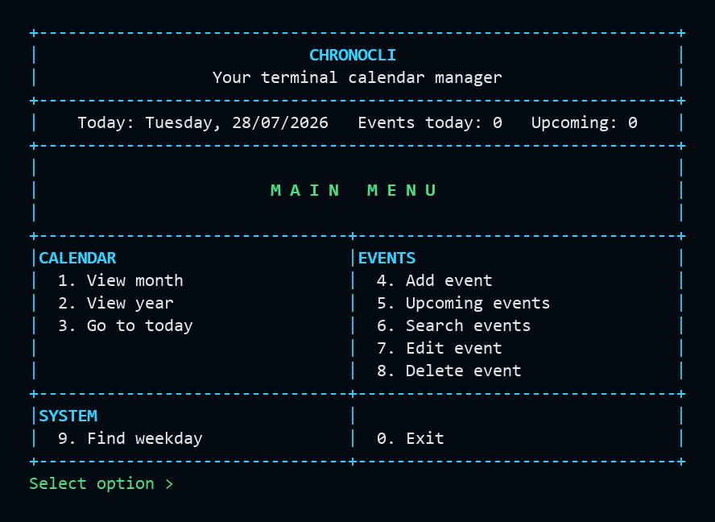

# ChronoCLI

<p align="center">
  <b>A modular C++17 terminal calendar and event manager</b>
</p>

<p align="center">
  <a href="https://github.com/rajkaushall/ChronoCLI/actions/workflows/ci.yml">
    
  </a>
  <a href="LICENSE">
    
  </a>
  
  
</p>

ChronoCLI is a terminal-based calendar and event manager built with modern C++17. It displays monthly and yearly calendars, marks dates with events, shows a Today dashboard, and manages local events with automatic safe saving.

The project is designed as a portfolio-ready C++ codebase: modular headers and source files, reusable terminal UI helpers, strict input handling, atomic file persistence, focused tests, CMake configuration, and CI support.

## Screenshot



## Features

- Display a bordered monthly calendar.
- Enter month and year together for the monthly calendar, for example `7 2026`.
- Display a full-year calendar as a bordered 4-month matrix.
- Highlight today with brackets and mark dates containing events with `*`.
- Show Today, Events today, and Upcoming counts on the home screen.
- Find the weekday for any valid date.
- Add, edit, delete, search, and list upcoming events.
- Confirm deletion before removing an event.
- Sort events chronologically.
- Automatically save after adding, editing, or deleting events.
- Save events safely using a temporary file and backup.
- Strictly reject malformed saved rows, invalid dates, duplicate IDs, and blank titles.

## Tech Stack

| Area | Technology |
| --- | --- |
| Language | C++17 |
| Build system | CMake |
| Tests | Custom C++ test runner + CTest |
| Storage | Local text file persistence |
| UI | ANSI-coloured terminal interface |
| Platform | Windows, Linux, WSL, macOS |

## Project Structure

```text
ChronoCLI/
|-- docs/
|   |-- architecture.md
|   |-- features.md
|   |-- learning-notes.md
|   `-- project-plan.md
|-- include/
|   |-- Calendar.hpp
|   |-- Date.hpp
|   |-- DateUtils.hpp
|   |-- EventManager.hpp
|   |-- InputUtils.hpp
|   `-- TerminalUI.hpp
|-- screenshots/
|   `-- chronocli-main-menu.png
|-- src/
|   |-- Calendar.cpp
|   |-- DateUtils.cpp
|   |-- EventManager.cpp
|   |-- InputUtils.cpp
|   |-- TerminalUI.cpp
|   `-- main.cpp
|-- tests/
|   `-- test_runner.cpp
|-- CMakeLists.txt
|-- LICENSE
`-- README.md
```

## Architecture

ChronoCLI keeps the terminal interface separate from core behavior:

- `main.cpp` owns the interactive workflow and menu routing.
- `TerminalUI` renders the bordered home screen, status row, menu grid, messages, and event tables.
- `Calendar` renders monthly and yearly calendars while delegating date math to `DateUtils`.
- `DateUtils` validates dates, calculates weekdays, compares dates, and computes day differences.
- `EventManager` stores events in memory, validates event data, sorts events, searches events, and saves/loads from disk.
- `InputUtils` centralizes reusable input helpers, including EOF-safe reads and whitespace trimming.
- `Date` is a small shared value type used across date and event modules.

## Build And Run

### Prerequisites

Install:

- A C++17 compiler such as `g++`, `clang++`, or MSVC.
- CMake 3.16 or newer.

### Windows / VS Code

Open the project folder in VS Code, then run:

```powershell
cmake -S . -B build
cmake --build build
.\build\chronocli.exe
```

### Linux / macOS / WSL

```bash
cmake -S . -B build
cmake --build build
./build/chronocli
```

### Build Directly With g++

If CMake is not available:

```powershell
g++ -std=c++17 -Wall -Wextra -pedantic -Iinclude src\main.cpp src\Calendar.cpp src\InputUtils.cpp src\DateUtils.cpp src\EventManager.cpp src\TerminalUI.cpp -o build\chronocli.exe
```

## Usage

When the app starts, it opens a bordered interactive menu:

```text
+------------------------------------------------------------------+
|                            CHRONOCLI                             |
|                 Your terminal calendar manager                   |
+------------------------------------------------------------------+
|   Today: Tuesday, 28/07/2026   Events today: 0   Upcoming: 0     |
+------------------------------------------------------------------+
|                                                                  |
|                        M A I N   M E N U                         |
|                                                                  |
+--------------------------------+---------------------------------+
|CALENDAR                        |EVENTS                           |
|  1. View month                 |  4. Add event                   |
|  2. View year                  |  5. Upcoming events             |
|  3. Go to today                |  6. Search events               |
|                                |  7. Edit event                  |
|                                |  8. Delete event                |
+--------------------------------+---------------------------------+
|SYSTEM                          |                                 |
|  9. Find weekday               |  0. Exit                        |
+--------------------------------+---------------------------------+
```

For View Month, enter month and year in one line:

```text
Enter month and year (MM YYYY): 7 2026
```

## Event Storage

Events are saved automatically after add, edit, and delete operations. The application stores data beside the executable:

```text
build/data/events.txt
```

Each row stores:

```text
id|day|month|year|title|description
```

The storage layer escapes special characters in event text, writes through a temporary file, preserves a backup, rejects malformed numeric fields, skips invalid rows, and prevents duplicate loaded IDs.

## Testing

Build and run tests with CMake:

```bash
cmake -S . -B build
cmake --build build
ctest --test-dir build --output-on-failure
```

Or run the test executable directly on Windows:

```powershell
.\build\chronocli_tests.exe
```

The test runner covers:

- Leap-year and century-year rules.
- Month lengths and Sunday-first weekday output.
- Date validation, comparison, and day differences.
- Year calendar matrix rendering.
- Event creation, validation, sorting, updating, searching, deletion, and persistence.
- Escaped event text.
- Invalid saved rows, duplicate IDs, restored event IDs, and EOF input handling.

## Roadmap

- CSV and JSON export.
- Recurring events.
- Reminder metadata.
- SQLite-backed storage.
- Real command-line subcommands such as `chronocli today` and `chronocli search`.

## Author

**Raj Kaushal**

- GitHub: [rajkaushall](https://github.com/rajkaushall)
- LinkedIn: [rajkaushall](https://linkedin.com/in/rajkaushall)
- LeetCode: [rajkaushall](https://leetcode.com/u/rajkaushall)

## License

This project is licensed under the [MIT License](LICENSE).
