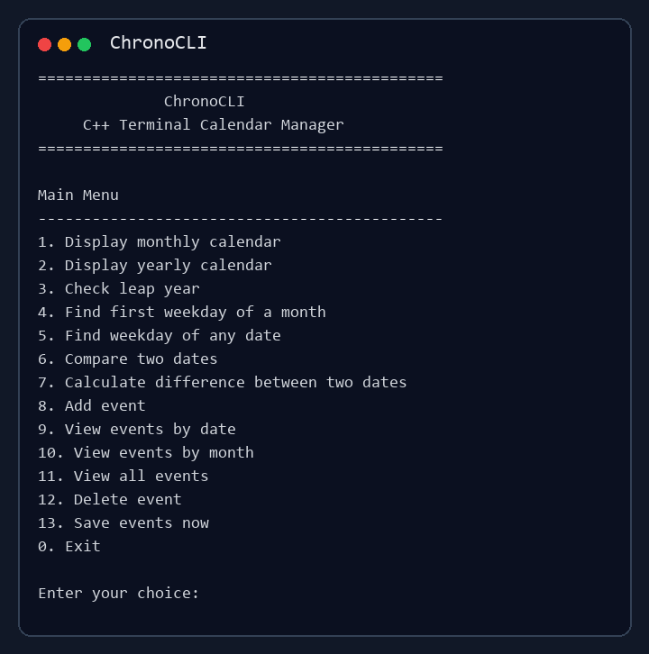
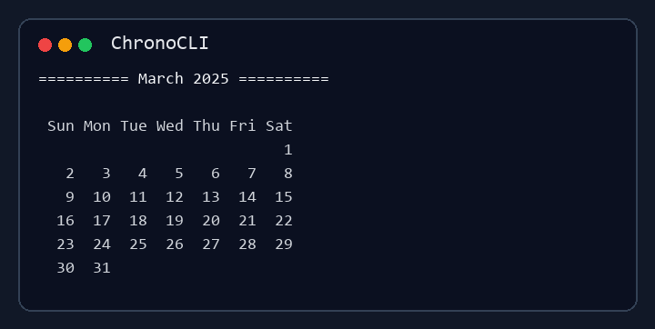
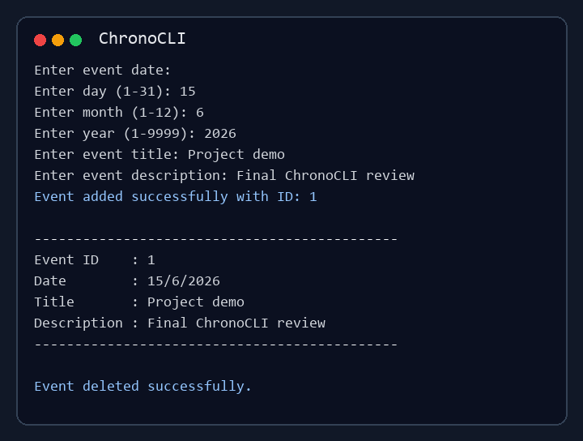
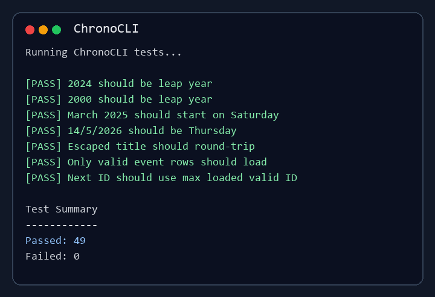

# ChronoCLI

<p align="center">
  <b>A modular C++17 terminal calendar and event manager</b>
</p>

<p align="center">
  <a href="https://github.com/rajkaushall/ChronoCLI/actions/workflows/ci.yml">
    
  </a>
  <a href="LICENSE">
    
  </a>
  
  
</p>

ChronoCLI is a terminal-based calendar and event management application built with modern C++17. It helps users display monthly and yearly calendars, validate and compare dates, calculate day differences, manage dated events, and store event data locally in a simple file format.

The project is designed as a portfolio-ready C++ codebase: modular headers and source files, clean input handling, file persistence, unit-style tests, CMake configuration, and GitHub Actions CI.

## Screenshots

### Main Menu



### Monthly Calendar



### Event Workflow



### Test Results



## Features

- Display monthly calendars with a Sunday-first layout.
- Display a full year of calendars.
- Check leap years and month lengths.
- Find the weekday for any valid date.
- Compare two dates.
- Calculate the absolute difference between two dates.
- Add, view, and delete events.
- View events by exact date, by month, or as a full list.
- Save events to `events.txt` and reload them on the next run.
- Preserve event IDs after loading saved data.
- Safely escape event text containing pipes, slashes, and line breaks.
- Skip malformed saved event rows during load.

## Tech Stack

| Area | Technology |
| --- | --- |
| Language | C++17 |
| Build system | CMake |
| Tests | Custom C++ test runner + CTest integration |
| CI | GitHub Actions |
| Storage | Local text file persistence |
| Platform | Windows, Linux, WSL, macOS |

## Project Structure

```text
ChronoCLI/
|-- .github/
|   `-- workflows/
|       `-- ci.yml
|-- docs/
|   |-- architecture.md
|   |-- features.md
|   |-- learning-notes.md
|   `-- project-plan.md
|-- include/
|   |-- Calendar.hpp
|   |-- Date.hpp
|   |-- DateUtils.hpp
|   |-- EventManager.hpp
|   `-- InputUtils.hpp
|-- screenshots/
|   |-- event-workflow.png
|   |-- main-menu.png
|   |-- monthly-calendar.png
|   `-- test-results.png
|-- src/
|   |-- Calendar.cpp
|   |-- DateUtils.cpp
|   |-- EventManager.cpp
|   |-- InputUtils.cpp
|   `-- main.cpp
|-- tests/
|   `-- test_runner.cpp
|-- CMakeLists.txt
|-- LICENSE
`-- README.md
```

## Architecture

ChronoCLI keeps the command-line interface separate from core behavior:

- `main.cpp` owns the interactive menu and user workflow.
- `Calendar` handles leap years, month lengths, weekday positioning, and terminal calendar output.
- `DateUtils` validates dates, calculates weekdays, compares dates, and computes day differences.
- `EventManager` stores events in memory and saves/loads them from disk.
- `InputUtils` centralizes reusable terminal input helpers.
- `Date` is a small shared value type used across date and event modules.

This structure keeps the code easy to test and makes future improvements, such as CSV export or recurring events, easier to add without rewriting the whole project.

## Build And Run

### Prerequisites

Install:

- A C++17 compiler such as `g++`, `clang++`, or MSVC.
- CMake 3.16 or newer.

### Build With CMake

```bash
cmake -S . -B build
cmake --build build
```

Run the app:

```bash
./build/chronocli
```

On Windows, the executable is usually:

```powershell
.\build\chronocli.exe
```

### Build Directly With g++

If CMake is not available, compile directly:

```powershell
g++ -std=c++17 -Wall -Wextra -pedantic -Iinclude src\main.cpp src\Calendar.cpp src\InputUtils.cpp src\DateUtils.cpp src\EventManager.cpp -o build\chronocli.exe
```

Then run:

```powershell
.\build\chronocli.exe
```

## Usage

When the app starts, it opens an interactive menu:

```text
=============================================
              ChronoCLI
     C++ Terminal Calendar Manager
=============================================

Main Menu
---------------------------------------------
1. Display monthly calendar
2. Display yearly calendar
3. Check leap year
4. Find first weekday of a month
5. Find weekday of any date
6. Compare two dates
7. Calculate difference between two dates
8. Add event
9. View events by date
10. View events by month
11. View all events
12. Delete event
13. Save events now
0. Exit
```

Example monthly calendar:

```text
========== March 2025 ==========

 Sun Mon Tue Wed Thu Fri Sat
                           1
   2   3   4   5   6   7   8
   9  10  11  12  13  14  15
  16  17  18  19  20  21  22
  23  24  25  26  27  28  29
  30  31
```

## Testing

Build and run tests with CMake:

```bash
cmake -S . -B build
cmake --build build
ctest --test-dir build --output-on-failure
```

Or compile and run the test runner directly:

```powershell
g++ -std=c++17 -Wall -Wextra -pedantic -Iinclude tests\test_runner.cpp src\Calendar.cpp src\InputUtils.cpp src\DateUtils.cpp src\EventManager.cpp -o build\chronocli_tests.exe
.\build\chronocli_tests.exe
```

The test runner covers:

- Leap-year and century-year rules.
- Month lengths and Sunday-first weekday output.
- Date validation, comparison, and day differences.
- Event creation, filtering, deletion, and persistence.
- Escaped event text.
- Invalid saved rows and restored event IDs after load.

## Event Storage

Events are saved to `events.txt` in the working directory. Each row stores:

```text
id|day|month|year|title|description
```

The storage layer escapes special characters in event text, including `|`, `\`, newlines, and carriage returns. On load, malformed rows and invalid dates are skipped while valid rows are preserved.

## Roadmap

Planned future improvements:

- Event search by title or description.
- Export events to CSV or JSON.
- Recurring events.
- Optional reminders.
- SQLite-backed storage.
- A small terminal UI refresh.

## Author

**Raj Kaushal**

- GitHub: [rajkaushall](https://github.com/rajkaushall)
- LinkedIn: [rajkaushall](https://linkedin.com/in/rajkaushall)
- LeetCode: [rajkaushall](https://leetcode.com/u/rajkaushall)

## License

This project is licensed under the [MIT License](LICENSE).
